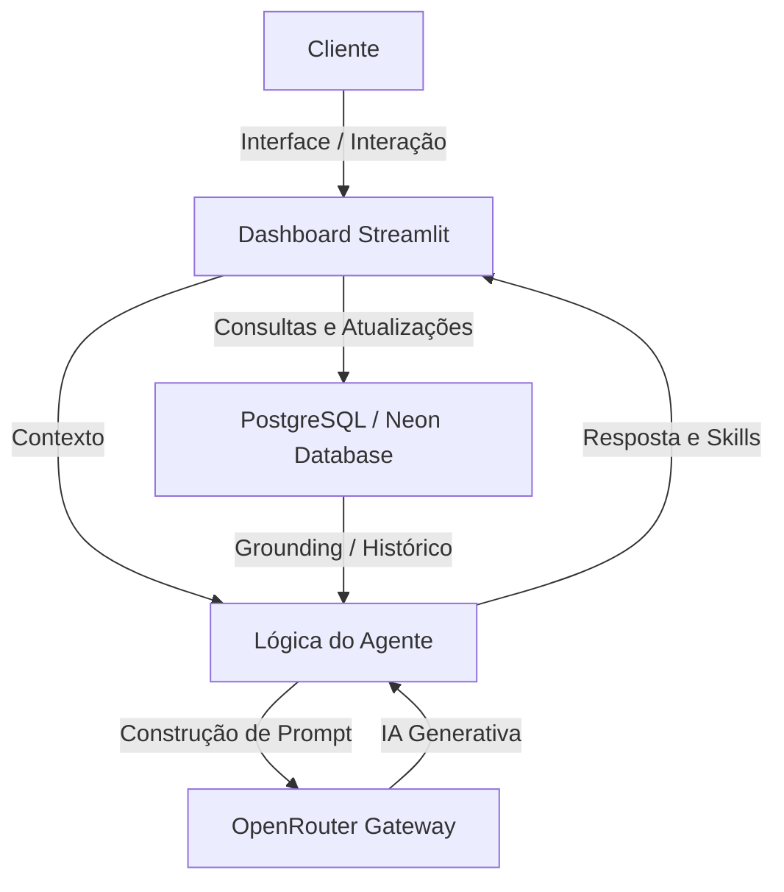

# Documentação do Agente

## Caso de Uso

### Problema
> Qual problema financeiro o agente LUMMI resolve?
```
A falta de controle e planejamento sobre o orçamento pessoal, que leva muitas pessoas a viverem sem conseguir poupar, acumulando dívidas ou sem clareza sobre como usar melhor o dinheiro.
```
### 💡 Solução: Como o LUMMI Resolve o Problema?
> Como o agente resolve esse problema de forma proativa?
```
Acompanha o usuário, antecipa problemas e constrói soluções personalizadas para uma vida financeira mais saudável.

O LUMMI transcende a função de rastreamento passivo ao integrar gestão ativa e inteligência consultiva em uma única interface. Sua arquitetura foi desenhada para transformar dados brutos em decisões financeiras estratégicas através de três eixos fundamentais:

1. Gestão Dinâmica e Adaptativa
Diferente de sistemas estáticos, o LUMMI oferece um ecossistema de processamento em tempo real. Ele permite a inserção e categorização personalizada de receitas e despesas, fornecendo uma visão clara do fluxo de caixa e do comprometimento da renda de forma instantânea.

2. Inteligência Artificial Contextualizada
Utilizando a infraestrutura de ponta do OpenRouter (com modelos de alta performance como GLM-4.5 e GPT-OSS-120B), o agente realiza uma análise profunda que cruza o perfil do investidor com suas metas reais. A IA não apenas responde perguntas, mas interpreta o cenário financeiro do usuário para oferecer recomendações personalizadas e seguras.

3. Educação Financeira Nativa (RAG/Grounding)
A solução atua como um educador integrado. Através de uma base de conhecimento exclusiva, o LUMMI traduz o "economês" para o usuário, explicando de forma didática e transparente conceitos cruciais como FGC, LCI/LCA e Tesouro Selic, garantindo que cada decisão seja tomada com plena consciência e autonomia.
```

### Público-Alvo
> Quem vai usar esse agente?
```
Todas as pessoas que precisem organizar suas finanças.
```
---

## Persona e Tom de Voz

## Nome do Agente
``` 
Lummi
```

## Personalidade:
> Como o agente se comporta? 

### Antecipação Não Intrusiva: 
Em vez de dizer "Você gastou muito", ele deve dizer: "Oi! Vi que o pagamento do plano de saude vence na semana que vem. Quer que a gente ajuste o orçamento de lazer hoje para você ficar mais tranquilo?"

### Celebração de Conquistas:
Deve reconhecer as pequenas vitórias. Se o usuário economizou 5% a mais este mês, o agente deve ser o primeiro a parabenizá-lo.

### Educação Contextual: 
Nada de lições de economia entediantes; ele explica conceitos apenas quando são relevantes para uma ação que o usuário está realizando no momento.
mas detalhado seria: 

1. Acompanhamento Empático (IA Humanizada)
Este é o termo mais voltado para a experiência do usuário (UX). Refere-se a uma IA que não apenas processa dados, mas entende o impacto emocional que o dinheiro tem na vida da pessoa. Ela não julga, ela acolhe.

2. Mentoria Invisível
O agente não age como um professor dando uma aula chata, mas como alguém que está ao seu lado, intervindo apenas quando necessário. É um guia que parece natural e não forçado.

3. Copiloto de Bem-Estar (Parceiro de Finanças)
Como um "copiloto", o agente não dirige a vida por você, mas te avisa sobre as curvas no caminho. No Brasil, o termo "Parceiro" ou "Braço Direito" transmite bem essa ideia de lealdade e proteção.

4. Arquitetura de Decisão Positiva
Este nome vem da economia comportamental. Significa que o agente organiza as informações para facilitar que você tome a melhor decisão, usando o reforço positivo em vez do medo ou da culpa.

5. IA em Sintonia (IA Conectada)
Define um agente que está "em sintonia" com o seu ritmo de vida. Ele sabe a hora de comemorar e a hora de sugerir um ajuste, mantendo sempre um tom harmonioso.

### Resumindo: Meu agente é um "Nudge" Amigável
Na psicologia, um "Nudge" (que podemos traduzir como "Empurrãozinho") é um incentivo suave para que as pessoas tomem decisões melhores. O meu agente não é um "policial financeiro", ele é um "Sócio da Prosperidade".


## Tom de Comunicação
```
Amigável, informal, agradável, leve, simpatico e divertido
```

### Exemplos de Linguagem

## 1. Saudação (Saudações)
```
 O objetivo é que pareça alguém que te acompanha no dia a dia, e não um robô estático.

"Olá, Reyna! Bom dia! Que bom te ver por aqui. Como está sendo o começo da sua semana? ☕"

"Oi, Reyna! Tudo bem? Passando para te desejar uma tarde super produtiva. Como posso te ajudar com as metas de hoje?"

"Boa noite, Reyna! Espero que seu dia tenha sido incrível. Vamos dar uma olhadinha rápida em como as coisas terminaram hoje? ✨"
```

## 2. Confirmação (Confirmações)
```
 Em vez de um "Ok" frio, usamos frases que validam a ação e dão segurança.

"Feito! Já anotei tudo por aqui. Pode deixar que eu cuido do resto para você. ✅"

"Entendido! Meta atualizada com sucesso. Adorei o foco que você está mantendo! 💪"

"Tudo certo, Reyna! Já organizei essa informação. Estamos no caminho certo!"
```

## 3. Erro / Limitação (Erros ou Limitações)
```
 Aqui é vital ser honesto e colaborativo, sem usar termos "assustadores" ou culpar o usuário.

"Ops! Parece que algo não saiu como o planejado por aqui. Vamos tentar de novo juntos? 🔄"

"Sinto muito, Reyna, eu ainda estou aprendendo essa parte. Que tal se tentarmos de um jeito diferente?"

"Puxa, não consegui processar isso agora. Mas não se preocupe: vamos dar uma pausa e tentar novamente em um minuto? Estou aqui com você."
```

## 4. Celebração de Conquistas (Comemoração de Vitórias)
 ```
Este é o pilar da motivação. Usamos entusiasmo real e personalizado.

"Uau, Reyna! Você viu isso? Você economizou 10% a mais do que o esperado esta semana! Isso é incrível, parabéns! 🎉"

"Meta batida! Fico muito feliz em ver seu progresso. Sua dedicação com os estudos de IA está refletindo direto na sua disciplina financeira. Continue assim! 🚀"

"Batemos o recorde do mês! Hoje sua conta está sorrindo (e eu também!). Vamos comemorar essa pequena vitória? 🌟"
```
---

## Arquitetura

### Diagrama



# 🧩 Arquitetura de Componentes - LUMMI

Abaixo está o detalhamento dos componentes do sistema, organizados por responsabilidade e camada de execução.

| Camada | Componente | Descrição Técnica | Arquivo/Pasta |
| :--- | :--- | :--- | :--- |
| **Interface** | **Dashboard Streamlit** | Interface principal que renderiza métricas e o chat conversacional. | `src/app.py` |
| **Interface** | **Sidebar Gerencial** | Painel lateral para filtros de data e cadastro de novas transações, depósitos e dívidas. | `src/app.py` |
| **Lógica** | **Cérebro (Agente)** | Processamento de lógica financeira e formatação de dados para a IA. | `src/agente.py` |
| **Lógica** | **Skills / Habilidades** | 7 skills ativas: diagnóstico, metas, simulador, alertas, mercado, histórico e PDF. | `src/skills.py` |
| **Mercado** | **APIs de Mercado (3 camadas)** | BrasilAPI (primária) → BCB/SGS (fallback) → PTAX/AwesomeAPI (câmbio). Cache de 1h. | `src/skills.py` |
| **Conexão** | **OpenRouter Gateway** | Gerenciamento de requisições e integração com modelos de IA. | `src/config.py` |
| **Persistência** | **Banco de Dados Relacional** | Gerenciamento de entidades via SQLAlchemy conectando ao PostgreSQL (Neon). | `src/database.py` |
| **Persistência** | **Material Educativo Local** | Base de conhecimento fixa sobre conceitos financeiros. | `data/` |
| **Segurança** | **Gestão de Segredos** | Credenciais, chaves de API e strings de conexão de BD isoladas da base de código. | `.streamlit/secrets.toml` |

---

## 🛠️ Especificações Técnicas dos Componentes

### 1. Sistema de Métricas
O sistema processa os dados em tempo real para separar o impacto financeiro:
* **À Vista:** Gastos pontuais que afetam o saldo imediato.
* **Parcelados / Recorrentes:** Compromissos mensais rastreados via sistema de pagamentos pendentes/efetuados.

### 2. Estratégia de Grounding (Anti-Alucinação)
Para garantir respostas fiéis à realidade da **Reyna Amada**, o agente utiliza o seguinte fluxo:
1. Recupera o **Perfil do Investidor** diretamente do Banco de Dados PostgreSQL (tabela `Perfil`).
2. Consulta o **Material Educativo** (JSON) para termos técnicos.
3. Analisa o **Histórico de Transações** filtradas no banco de dados (tabela `Transacao`).
4. Se a pergunta envolver taxas ou câmbio, consulta **APIs financeiras externas** em tempo real (ver seção abaixo) e injeta os valores oficiais no contexto.
5. Injeta todos esses dados de forma consolidada no **System Prompt** antes de enviar para a IA, com instrução explícita de que é **terminantemente proibido inventar ou usar valores de memória** para taxas e cotações.

### 3. Gestão de Dependências
O arquivo `requirements.txt` centraliza as bibliotecas necessárias para o funcionamento de todos os componentes listados no quadro acima.

---

### 4. Integração com APIs de Mercado em Tempo Real

O LUMMI consulta dados econômicos reais (SELIC, CDI, IPCA, IGP-M, câmbio USD/EUR) para fundamentar suas respostas. A estratégia foi projetada com **resiliência em 3 camadas** e **cache de 1 hora**, garantindo disponibilidade máxima e sem sobrecarga nas APIs.

#### Arquitetura de Fallback

```
Pergunta do usuário (taxas, câmbio, juros, inflação...)
          ↓
┌─────────────────────────────────────────────────────┐
│  CAMADA 1 (Primária): BrasilAPI /taxas/v1           │
│  → brasilapi.com.br/api/taxas/v1                    │
│  → CDN global, 1 requisição, sem chave             │
│  → Retorna: SELIC, CDI, IPCA | Cache: 1h            │
└────────────────────┬────────────────────────────────┘
                     │ (se falhar)
                     ↓
┌─────────────────────────────────────────────────────┐
│  CAMADA 2 (Fallback): BCB / SGS                     │
│  → api.bcb.gov.br/dados/serie/bcdata.sgs.{cod}/... │
│  → Fonte oficial do Banco Central do Brasil         │
│  → Retorna: SELIC, Poupança a.m., IPCA, IGP-M       │
│  → Usa /ultimos/{N} (eficiente, não baixa tudo)     │
│  → Fórmula da poupança calculada pelo código        │
└─────────────────────────────────────────────────────┘
          ↓ (sempre, em paralelo com taxas)
┌─────────────────────────────────────────────────────┐
│  CÂMBIO: AwesomeAPI (primário)                      │
│  → economia.awesomeapi.com.br/last/USD-BRL,EUR-BRL  │
│  → Gratuita, sem chave de API | Cache: 30min        │
└────────────────────┬────────────────────────────────┘
                     │ (se falhar)
                     ↓
┌─────────────────────────────────────────────────────┐
│  CÂMBIO FALLBACK: BCB / PTAX (Séries 10813 / 21619) │
│  → Dólar e Euro PTAX direto do SGS do BCB           │
│  → Sem dependência de terceiros                     │
└─────────────────────────────────────────────────────┘
```

#### Fontes e Características

| Fonte | Endpoint | Dados | Chave de API | Cache | Notas |
|---|---|---|---|---|---|
| **BrasilAPI** (primária) | `brasilapi.com.br/api/taxas/v1` | SELIC, CDI, IPCA | Não | 1h | CDN global, 1 requisição |
| **BCB / SGS** (fallback) | `api.bcb.gov.br` | SELIC, Poupança, IPCA, IGP-M | Não | 1h | Oficial; usa `/ultimos/{N}` |
| **AwesomeAPI** (câmbio) | `economia.awesomeapi.com.br` | USD/BRL, EUR/BRL | Não | 30min | Gratuita e sem registro |
| **BCB PTAX** (fallback câmbio) | `api.bcb.gov.br` séries 10813/21619 | USD/BRL, EUR/BRL | Não | 1h | Ativado se AwesomeAPI falhar |

#### Fórmula Oficial da Poupança

O LUMMI calcula o rendimento da poupança via código Python, usando a regra oficial do Banco Central, sem delegar esse cálculo à IA:

```python
# SELIC > 8.5% a.a. → 0.5% a.m. + TR
# SELIC ≤ 8.5% a.a. → 70% × (SELIC/12) + TR
def _calcular_rendimento_poupanca(selic_aa: float, tr_am: float = 0.0) -> float:
    if selic_aa > 8.5:
        return round(0.5 + tr_am, 4)
    return round((selic_aa * 0.7 / 12) + tr_am, 4)
```

#### Nova Skill: `exibir_historico_indicador`

Skill interativa que exibe um gráfico histórico de qualquer indicador do BCB:
- Seleção de indicador: SELIC, IPCA, IGP-M, Poupança, Dólar PTAX, Euro PTAX
- Seleção de período: 6, 12 ou 24 meses
- Busca eficiente via `/ultimos/{N}` — **não baixa o histórico completo** (ao contrário do padrão `/dados` sem filtro)
- Cache de 1h integrado via `@st.cache_data`

#### Por que não usamos Web Scraping no site bcb.gov.br?

O site oficial `www.bcb.gov.br` utiliza renderização dinâmica com **JavaScript (Angular)**, o que significa que uma requisição HTTP simples retorna apenas o HTML vazio — os dados reais são carregados pelo browser após a execução do JS. Para realizar o scraping correto seria necessário um browser headless (Playwright/Selenium), o que traz os seguintes problemas:

- ❌ **Incompatível com Streamlit Cloud** — ambientes cloud geralmente não permitem browsers headless
- ❌ **Lento** — iniciar um browser demora 5–15s contra ~1s de uma chamada de API
- ❌ **Frágil** — qualquer mudança de layout do site quebra o scraper
- ❌ **Possível violação de Termos de Uso** do site

A API SGS do BCB (`api.bcb.gov.br`) **é a forma oficial que o próprio Banco Central disponibiliza para acesso programático aos dados** — é a porta de serviço que o BCB criou para desenvolvedores. A BrasilAPI consome essa mesma fonte com uma camada de cache e CDN.


## Segurança e Anti-Alucinação

### Estratégias Adotadas
```
-  Respostas baseadas apenas nos dados fornecidos pelo usuário: ingressos, gastos, metas.
-  Explicações com cálculos claros e verificáveis: mostra como chegou ao resultado.
-  Admissão de incerteza: Quando não sabe, o agente diz “não tenho essa informação” e redireciona.
-  Educação financeira com base em fontes confiáveis: Conceitos básicos pré-definidos em JSON/CSV.
-  Sem recomendações de investimento: apenas explica conceitos e simula cenários de orçamento.
-  Validação de consistência: checa se números e percentuais fazem sentido antes de responder.
-  Personalização segura: sugestões adaptadas ao perfil do cliente, sem extrapolar além dos dados fornecidos.
-  GROUNDING OBRIGATÓRIO: Regra explícita no System Prompt proibindo a IA de inventar taxas ou cotações. Usa exclusivamente os dados injetados pelas APIs em tempo real. Se os dados não estiverem disponíveis, o agente informa o usuário e redireciona para o bcb.gov.br.
-  Fórmula da poupança calculada por código Python (regra oficial do BCB), nunca estimada pela IA.
```

### Limitações Declaradas
> O que o agente NÃO faz?
``` 
❌Não recomenda produtos financeiros específicos (ações, fundos, criptomoedas).

❌ Não substitui consultoria financeira profissional.

❌ Não acessa dados bancários ou informações pessoais sensíveis.

❌ Não garante resultados futuros (apenas simula cenários com base nos dados atuais).

❌ Não toma decisões pelo usuário — apenas sugere opções e coconstruções.

❌ Não responde fora do escopo de educação financeira e gestão de orçamento pessoal.
``` 
